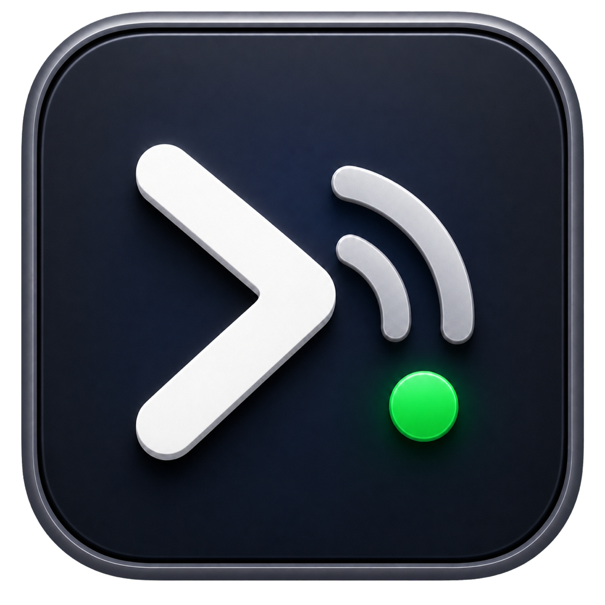
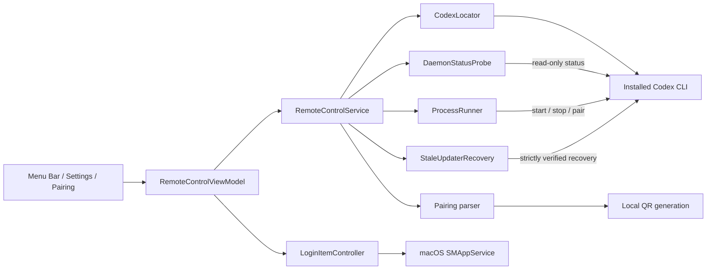

<p align="center">
  
</p>

<h1 align="center">Codex Remote</h1>

<p align="center">
  Native Remote Control for Codex on macOS.
</p>

<p align="center">
  Menu bar native · Automatic recovery · QR pairing · Privacy-conscious
</p>

<p align="center">
  <a href="https://github.com/ulissescomonian/codex-remote/releases/tag/v1.0"></a>
  
  
  
  <a href="https://github.com/ulissescomonian/codex-remote/releases/tag/v1.0"></a>
  <a href="https://github.com/ulissescomonian/codex-remote/actions/workflows/ci.yml"></a>
  <a href="LICENSE"></a>
</p>

<p align="center">
  <a href="https://github.com/ulissescomonian/codex-remote/releases/download/v1.0/CodexRemote-1.0-arm64.dmg"><strong>Download Codex Remote 1.0 for Apple Silicon (.dmg)</strong></a>
  <br>
  <a href="https://github.com/ulissescomonian/codex-remote/releases/tag/v1.0">Release notes and SHA-256 checksum</a>
</p>

> [!IMPORTANT]
> Codex Remote 1.0 (build 1) is an experimental Preview. Its Apple Silicon
> app has a local ad-hoc signature, not an Apple Developer ID signature. Neither
> the app nor the DMG is notarized by Apple. Install it only from a source you
> trust, and never disable Gatekeeper to open it.

## What Codex Remote does

Codex Remote turns the experimental `codex remote-control` CLI into a native, always-visible macOS experience. Check daemon health at a glance, start or restart it without opening Terminal, recover safely after Codex updates, and pair a phone by scanning a QR code.

It runs entirely from the menu bar, stays out of the Dock, and uses the official Codex CLI commands instead of implementing a separate remote-control protocol.

## Highlights

- **Live daemon status** — Distinguishes running, stopped, and unknown states and shows the detected CLI and App Server versions.
- **One-click controls** — Start, Stop, Restart, refresh, pair a device, open Settings, or quit from a compact menu.
- **Clear restart phases** — Shows when the app is stopping, starting, and waiting for Remote Control to reconnect.
- **Launch at login** — Uses the native `SMAppService` API, including macOS approval and registration states.
- **Keep-alive mode** — Starts Remote Control on launch and restores it after an unexpected stop.
- **Update recovery** — Safely retires either a verified old-release updater or any managed standalone updater wedged behind its recorded zombie app-server child.
- **Independent recovery retry** — Performs the required second safety check after 30 seconds without waiting for the visual polling interval.
- **QR code pairing** — Generates the official ChatGPT pairing URL locally while keeping the manual code available as a fallback.
- **Automatic CLI discovery** — Finds common standalone, Homebrew, app-bundled, and `PATH` installations, with a custom override in Settings.
- **Configurable polling** — Choose a 5, 15, 30, or 60-second status interval without icon flicker.
- **Privacy-conscious** — Does not read `~/.codex/auth.json`, persist pairing artifacts, or add telemetry.
- **Lightweight native app** — SwiftUI menu bar interface, no Dock icon, no third-party Swift dependencies.

## Requirements

- macOS 14 or later.
- Codex CLI installed and authenticated.
- Xcode with Swift 5.9 or later to build from source.
- An Apple Silicon Mac for the currently documented validation path. Intel and universal builds have not been validated yet.

Remote Control is an experimental Codex surface and may change between CLI releases. Codex Remote isolates the CLI-specific behavior behind services and protocols, but a future Codex update may still require an app update.

## Installation

The Preview DMG is built for Apple Silicon and contains `Codex Remote.app` plus
an Applications shortcut.

### Install the Preview DMG

1. Download `CodexRemote-1.0-arm64.dmg` and its `.sha256` file from the
   [v1.0 Release](https://github.com/ulissescomonian/codex-remote/releases/tag/v1.0).
2. Optionally verify the download in Terminal:

   ```bash
   cd ~/Downloads
   shasum -a 256 -c CodexRemote-1.0-arm64.dmg.sha256
   ```

3. Open the DMG and drag **Codex Remote.app** to **Applications**.
4. In Finder, Control-click the installed app and choose **Open**.
5. If macOS still blocks it, use **System Settings → Privacy & Security → Open
   Anyway**. Never disable Gatekeeper globally.

The app is ad-hoc signed so macOS can verify the internal integrity of its
bundle. It has no Apple Team ID, is not Developer ID signed, and is not
notarized. The DMG is also unsigned and not notarized.

### First Launch

1. Open `CodexRemote.app`. It appears in the macOS menu bar and intentionally does not appear in the Dock.
2. Codex Remote locates the Codex executable and probes the local app-server daemon.
3. By default, it enables both **keep Remote Control active** and **open Codex Remote at login**.
4. If macOS requires approval for the login item, open **Settings > General > Login Items & Extensions** and allow Codex Remote.
5. If the CLI cannot be found automatically, open **Ajustes…** and choose the executable under **Codex CLI**.

The current interface is written in Brazilian Portuguese; this README uses English descriptions and includes the corresponding UI labels where useful.

### Build from Source

```bash
git clone https://github.com/ulissescomonian/codex-remote.git
cd codex-remote
make bundle
```

`make bundle` performs a release build, creates `.build/CodexRemote.app`, copies the icon and `Info.plist`, validates the property list, and applies a local ad-hoc signature.

Install a source build in `/Applications` for reliable launch-at-login behavior:

```bash
ditto .build/CodexRemote.app /Applications/CodexRemote.app
open /Applications/CodexRemote.app
```

## Using Codex Remote

Open the menu bar item to see daemon status, installed versions, the last verification time, available actions, and the most recent warning or error.

| UI action | Behavior |
|-----------|----------|
| **Iniciar** (Start) | Runs `codex remote-control start --json` and refreshes local daemon state. |
| **Parar** (Stop) | Runs `codex remote-control stop --json` and suppresses automatic recovery for the current app session. |
| **Reiniciar** (Restart) | Stops and starts sequentially while reporting stop, start, and reconnection phases. |
| **Parear novo dispositivo…** | Requests temporary pairing artifacts and opens the QR/manual-code window. |
| **Atualizar** (Refresh) | Runs an immediate read-only daemon status probe. |
| **Ajustes…** (Settings) | Opens startup, login item, CLI path, and polling preferences. |
| **Sair** (Quit) | Quits Codex Remote without deliberately stopping the Codex daemon. |

Conflicting actions remain disabled while a mutable operation is running.

## Status Model

Codex Remote uses the local control socket through:

```text
codex app-server daemon version
```

The result maps to three states:

| State | Meaning |
|-------|---------|
| **Daemon active** | The local control socket responded with valid JSON. CLI and App Server versions are shown when available. |
| **Daemon stopped** | The socket is missing, refused the connection, or otherwise reports that the daemon is not running. |
| **Unknown** | The probe timed out, returned invalid JSON, or failed for a reason that cannot safely be classified as stopped. |

An active daemon proves that the local app-server is responding. It does **not** prove that the remote cloud connection is currently `connected`. When the daemon is healthy but the CLI reports a transient remote connection error during Start, Codex Remote displays an amber record of that last startup event instead of incorrectly presenting it as the current remote status.

## Automatic Start and Recovery

Two independent settings are enabled by default:

1. **Iniciar e manter o Remote Control ativo** — Start and keep the daemon active.
2. **Abrir Codex Remote ao iniciar sessão** — Open the menu bar app at macOS login.

With keep-alive enabled, Codex Remote:

- starts the daemon when the app opens and finds it stopped;
- detects an external or update-related stop during status reconciliation;
- limits automatic attempts to avoid a tight restart loop;
- schedules one follow-up attempt after 30 seconds when the first automatic attempt fails with the daemon still stopped;
- cancels a pending retry after recovery, opt-out, or a manual Stop;
- keeps manual Stop authoritative until the user starts again or reopens the app.

The follow-up retry is independent of the visual polling preference. A 60-second status interval therefore cannot delay the required second updater confirmation.

### Safe Recovery After Codex Updates

Standalone Codex updates can occasionally leave an older `app-server daemon pid-update-loop` process alive while `current` points to a newer release. A current updater can also become wedged when its recorded app-server child exits as a zombie and is never reaped. Codex Remote only enters the exceptional recovery path after a Start error contains both:

```text
app server did not become ready
app-server-control.sock
```

The recovery sequence is deliberately strict:

1. Attempt the official `codex remote-control stop --json` command.
2. Inspect the updater even if the official Stop reports success; a successful response is not proof that the process manager is healthy.
3. Open the updater PID record without following symlinks and require a small regular file owned by the current user.
4. Verify PID, UID, process start time, exact arguments, loaded executable, standalone release path, and the current release target.
5. For an old-release updater, require the same fingerprint to remain stable for at least 30 seconds.
6. Before the time-based old-updater path, independently load the secured app-server PID record and require the recorded process to be a same-user zombie whose PPID is the updater, whose start time still matches, and whose control socket is absent. This immediate path accepts a parent loaded from either the previous or current managed standalone release, including the update transition where its command already points at `current`.
7. Re-read both PID records and revalidate every externally mutable identity immediately before signaling.
8. Send one `SIGTERM` to the verified updater.

The zombie path does not wait 30 seconds because a zombie cannot resume execution and the parent and child are already validated twice; signaling is still idempotent. Recovery never sends `SIGKILL` to the updater, never deletes either PID file, and never signals the same verified fingerprint twice. The generic process runner separately retains a `SIGKILL` fallback for the short-lived CLI command itself if that command ignores its timeout.

## Device Pairing

Pairing uses the official machine-readable command:

```text
codex remote-control pair --json
```

Current Codex responses contain an opaque `pairingCode`, an optional `manualPairingCode`, and an expiration time. Codex Remote keeps the QR and manual artifacts separate.

The QR code encodes:

```text
https://chatgpt.com/codex/pair?pairing_code=<URL-encoded opaque pairing code>
```

The manual code is never substituted into the QR payload. The QR image is generated locally with Core Image using error correction level M, integer scaling, and a four-module quiet zone.

Pairing data lives only in memory and is discarded when the pairing window closes. Codex Remote does not persist the pairing response or include it in error messages. Choosing **Copiar código** intentionally places the manual code on the macOS clipboard.

## Settings

| Setting | Default | Description |
|---------|---------|-------------|
| **Start and keep Remote Control active** | On | Starts a stopped daemon and restores unexpected stops. |
| **Open Codex Remote at login** | On | Registers the app with `SMAppService.mainApp`. |
| **Codex CLI path** | Automatic | Overrides CLI discovery with a user-selected executable. |
| **Status refresh interval** | 15 seconds | Selects 5, 15, 30, or 60-second polling. |

The login item controller represents the actual macOS state: enabled, disabled, approval required, or app not found. When approval is required, Settings provides a shortcut to the system Login Items panel.

## Codex CLI Discovery

Unless a custom executable is selected, Codex Remote searches in this order:

1. `~/.local/bin/codex`
2. `/opt/homebrew/bin/codex`
3. `/usr/local/bin/codex`
4. `/Applications/Codex.app/Contents/Resources/codex`
5. `/Applications/ChatGPT.app/Contents/Resources/codex`
6. Every directory in `PATH`

Every candidate must be an executable file. A configured override supports `~` expansion and fails with a clear error if it is no longer executable.

## How It Works

Codex Remote is organized around small, injectable services so UI behavior can be tested without launching the real daemon.



| Component | Responsibility |
|-----------|----------------|
| `CodexRemoteApp` | SwiftUI scenes, menu bar presentation, pairing window, and Settings. |
| `AppLifecycleCoordinator` | Starts reconciliation from `applicationDidFinishLaunching`, owns one polling task, rereads preferences, and shares the UI state. |
| `RemoteControlViewModel` | Main-actor state, action serialization, phased restart, keep-alive policy, and scheduled recovery. |
| `RemoteControlService` | Start, Stop, Restart, Pair, JSON parsing, and exceptional recovery orchestration. |
| `ProcessRunner` | Direct process execution, separate stdout/stderr capture, bounded timeouts, TERM/KILL command cleanup, and late-callback safety. |
| `DaemonStatusProbe` | Read-only local socket status and version parsing. |
| `CodexLocator` | CLI discovery and persisted custom path override. |
| `StaleUpdaterRecovery` | Fail-closed identity validation for old-release updaters and managed updaters wedged behind a recorded zombie child. |
| `PairingQRCodeGenerator` | Offline QR rendering through Core Image. |
| `LoginItemController` | Native login item registration, approval state, and preference reconciliation. |

All Codex commands are launched with a direct executable URL and separate arguments. Production code never constructs an interpolated `/bin/zsh -c` command.

## Security and Privacy

- **No credential access** — Codex Remote does not read `~/.codex/auth.json`.
- **No custom remote protocol** — It delegates remote behavior to the installed Codex CLI.
- **No telemetry** — The app does not include analytics or tracking.
- **No secret persistence** — Pairing codes, QR payloads, tokens, and complete command output are not stored in `UserDefaults`.
- **Local QR generation** — Rendering the QR image does not call a separate network service.
- **Direct process execution** — Executables and arguments are passed separately without shell interpolation.
- **Bounded process operations** — Every command has a timeout; inherited pipe handles cannot keep the UI waiting past the deadline.
- **Fail-closed updater recovery** — Any identity mismatch prevents signaling the candidate process.
- **Sanitized diagnostics** — Managed app-server history, ANSI sequences, absolute local paths, and credential-shaped values are not shown in menu errors.
- **Safe tests** — Unit tests use fakes for all Codex daemon mutations and never call real Start, Stop, or Pair operations.

The Codex CLI itself requires network access for Remote Control. “Local QR generation” does not mean that the complete Remote Control workflow operates offline.

## Development

### Toolchain Setup

If Xcode is installed but not selected:

```bash
sudo xcode-select -s /Applications/Xcode.app/Contents/Developer
sudo xcodebuild -runFirstLaunch
```

The project uses Swift Package Manager and does not require an `.xcodeproj`.

### Build and Test

```bash
swift build
swift test
```

Convenience targets are also available:

```bash
make build
make test
make bundle
make dmg
make run
make clean
```

### Required Validation

Before publishing a change:

```bash
swift build
swift test
make bundle
plutil -lint .build/CodexRemote.app/Contents/Info.plist
codesign --verify --deep --strict .build/CodexRemote.app
```

The current test suite contains 84 tests across 7 suites, covering process timeouts, daemon state, update recovery, app lifecycle, login items, QR generation and decoding, pairing parsing, automatic retries, and view-model behavior. Tests do not mutate the user's real Codex daemon.

### Package the Preview DMG

After the validation gates pass, create and verify the release artifacts:

```bash
make dmg
(cd dist && shasum -a 256 -c CodexRemote-1.0-arm64.dmg.sha256)
```

`Scripts/package_app.sh` builds and verifies the ad-hoc signed application.
It regenerates the ICNS from the transparent 1024-pixel PNG before assembling
the bundle.
`Scripts/package_dmg.sh` validates its identifier, version, executable,
architecture, and signature; stages the app with an Applications shortcut;
creates and verifies a compressed disk image; and writes a SHA-256 sidecar.
Generated files remain under `dist/` and are attached to the GitHub Release,
not committed to the repository.

The scripts do not provide Developer ID signing, timestamping, notarization, or
stapling. Those require an Apple Developer Program identity and a separate
release pipeline.

### Project Structure

```text
.
├── .github/workflows/ci.yml          # Tests and Release bundle validation
├── AGENTS.md                         # Project contracts for coding agents
├── CONTRIBUTING.md                   # Development and distribution workflow
├── Package.swift                     # SwiftPM executable and test targets
├── Makefile                          # Build, test, bundle, DMG, run, and clean
├── Resources/
│   ├── AppIcon.icns                  # App bundle icon
│   ├── AppIcon.png                   # Source/readme icon
│   └── Info.plist                    # Bundle metadata and LSUIElement
├── Scripts/
│   ├── make_icon.sh                   # Generate ICNS from the alpha PNG
│   ├── package_app.sh                # Assemble, sign, and verify the app
│   └── package_dmg.sh                # Create the DMG and SHA-256 sidecar
├── SECURITY.md                       # Vulnerability reporting and boundaries
├── Sources/CodexRemote/
│   ├── App/
│   │   ├── CodexRemoteApp.swift      # Scenes and menu bar presentation
│   │   ├── AppDelegate.swift         # Reliable launch lifecycle and polling
│   │   ├── RemoteControlViewModel.swift
│   │   └── AppPreferences.swift
│   ├── Domain/                       # Pure models and service protocols
│   ├── Services/
│   │   ├── ProcessRunner.swift
│   │   ├── RemoteControlService.swift
│   │   ├── DaemonStatusProbe.swift
│   │   ├── StaleUpdaterRecovery.swift
│   │   ├── PairingQRCodeGenerator.swift
│   │   ├── CodexLocator.swift
│   │   ├── LoginItemController.swift
│   │   └── LoginItemService.swift
│   └── Views/                         # Menu, pairing, and Settings views
├── Tests/CodexRemoteTests/            # 7 suites; no real daemon mutations
└── docs/
    ├── 01-product-plan.md
    ├── 02-architecture.md
    └── 03-validation.md
```

## Troubleshooting

### The app does not appear in the Dock

This is intentional. Codex Remote is an `LSUIElement` accessory app and appears only in the menu bar.

### Codex CLI was not found

Open **Ajustes…**, choose the executable in the **Codex CLI** section, and retry. Clear the field to restore automatic discovery.

Useful checks:

```bash
which codex
codex --version
```

### The daemon is stopped after a Codex update

Keep-alive recovery starts from the app lifecycle and whenever the next status check detects the stopped daemon. If an updater from an old release is present without stronger evidence, Codex Remote waits for the required 30-second fingerprint confirmation and performs the second attempt independently of the configured visual polling interval. If a managed updater owns a recorded zombie app-server child, the app prioritizes the separately validated zombie path without that delay.

You can inspect the local status without changing it:

```bash
codex app-server daemon version
```

If the app still reports a failure, preserve the short error shown in the menu before changing processes manually. Historical managed app-server logs and local paths are intentionally omitted from that message.

### “Daemon active” appears with an amber warning

The local daemon is responding, but the Codex CLI reported during the last Start that the remote connection had not finished recovering at that moment. The card is a historical startup warning, not a live remote-status indicator. It remains visible until dismissed or replaced by a later mutable operation.

### Stop did not automatically start again

That is intentional. Manual Stop suppresses keep-alive for the current app session. Choose **Iniciar** or reopen Codex Remote to resume automatic recovery.

### Launch at login requires approval

Open Codex Remote Settings and select **Abrir Ajustes do Sistema**, then approve the app under **General > Login Items & Extensions**. Installing the bundle in `/Applications` avoids path changes that can invalidate login item registration.

### Pair is disabled or only a manual code is shown

Pairing is available only while the local daemon is active. Older or transitional Codex responses may provide only a manual code; Codex Remote preserves that compatibility path instead of inventing a QR payload.

## Current Limitations

- `codex remote-control` is experimental and its command or JSON contracts may change.
- Status currently proves local daemon health, not the complete remote cloud connection state.
- The app does not yet provide `codex doctor` diagnostics in the UI.
- There is no built-in app updater.
- The distributed app is ad-hoc signed rather than Developer ID signed, and neither the app nor DMG is notarized.
- The Preview DMG is Apple Silicon-only; Intel and universal distribution have not been verified.
- The current UI is Brazilian Portuguese only.
- Manual end-to-end Pair and a clean reboot/login validation of the installed `SMAppService` flow remain distribution checklist items.

## Documentation

- [Product plan](docs/01-product-plan.md)
- [Architecture](docs/02-architecture.md)
- [Validation record](docs/03-validation.md)
- [Contributing](CONTRIBUTING.md)
- [Security policy](SECURITY.md)

## Acknowledgments

Built around the experimental [OpenAI Codex CLI](https://github.com/openai/codex) Remote Control commands.

Codex Remote is an independent utility and is not affiliated with or endorsed by OpenAI. Codex and OpenAI are trademarks of OpenAI.

## License

[MIT License](LICENSE) — free to use, modify, and distribute.
